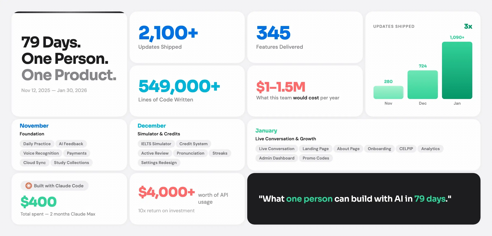
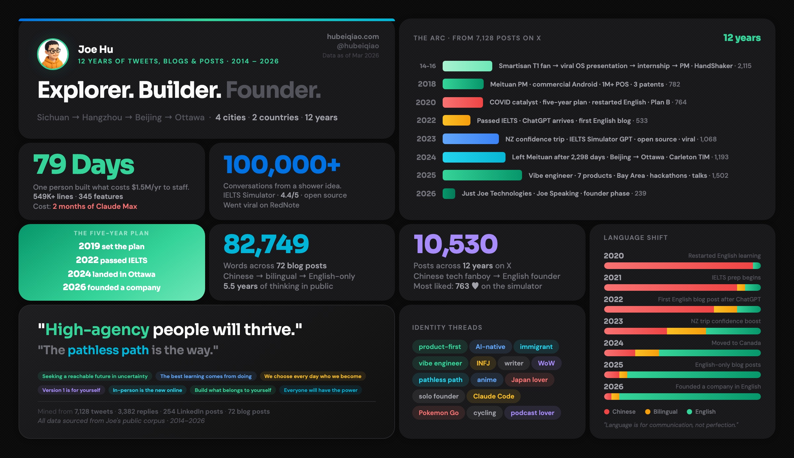
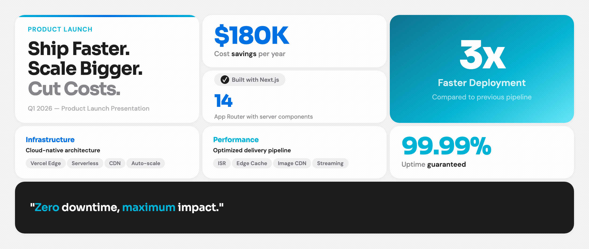
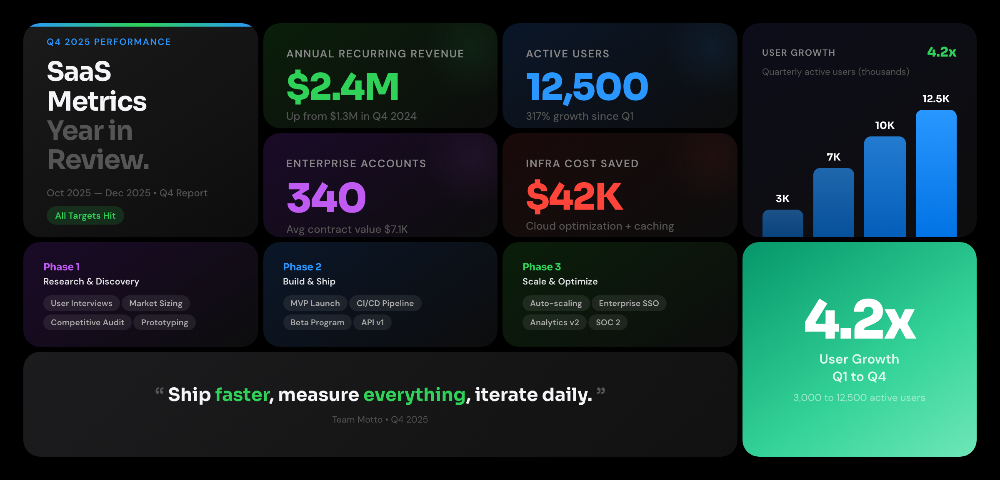
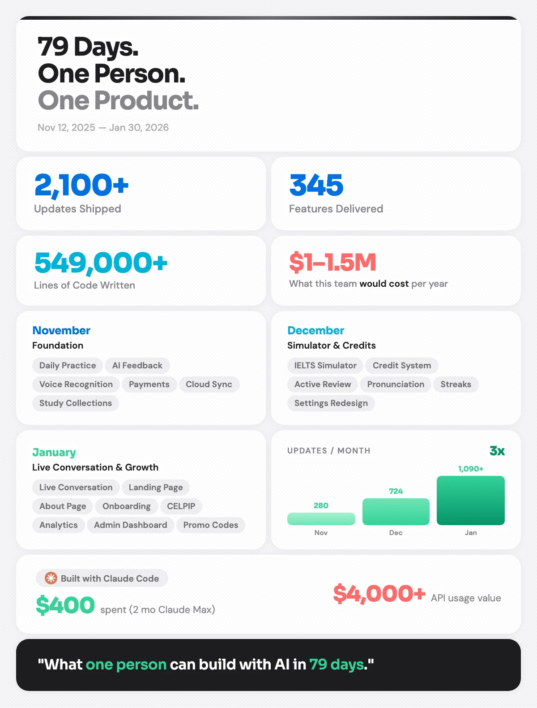
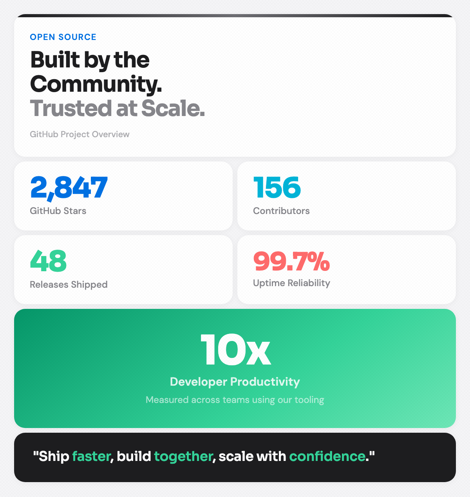
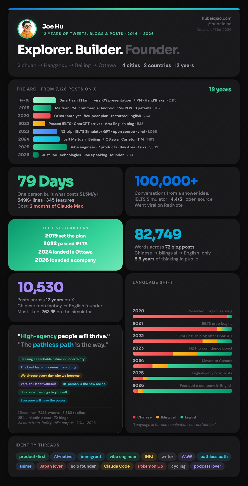

# Apple Bento Grid

A skill for AI coding agents that generates Apple-inspired bento grid presentation cards as self-contained HTML files. No design tools needed — just describe your stats and get pixel-perfect output.

> Compatible with [Claude Code](https://claude.com/claude-code), [OpenAI Codex](https://openai.com/index/codex/), [Cursor](https://cursor.sh), and other agents that support the [Agent Skills](https://agentskills.io) standard.

## Examples

All made with this skill — just describe your data and get pixel-perfect output.

**Solo Dev Project Stats** — 79 days of building, tracked as product metrics



**Personal Data Dashboard** — 12 years of writing & social media activity



**Product Launch** — Light and dark themes

| Light | Dark |
|-------|------|
|  |  |

**Chinese New Year Launch** — Square format (1200x1200) with festive theme


**Vertical / Social Media** — Portrait format for social posts

| Project Stats | GitHub Social | Personal Dashboard |
|--------------|--------------|-------------------|
|  |  |  |

## Installation

### Claude Code Plugin (recommended)

```bash
/plugin marketplace add hubeiqiao/apple-bento-grid
/plugin install apple-bento-grid@apple-bento-grid-marketplace
```

### Agent Skills

Install from the [Agent Skills Directory](https://skills.sh):

```bash
npx skills add hubeiqiao/apple-bento-grid
```

### Manual

Clone directly into your Claude Code skills directory:

```bash
git clone https://github.com/hubeiqiao/apple-bento-grid.git ~/.claude/skills/apple-bento-grid
```

Or add it as a project skill in `.claude/skills/`.

## Usage

In your AI coding agent, just describe what you want to visualize. You don't need to be specific — the skill figures out the best layout, theme, and card types for you.

**Quick start:**
```
Use /apple-bento-grid to visualize my project stats
```

**Explore different use cases:**
```
Use /apple-bento-grid to visualize my startup's growth journey
```
```
Use /apple-bento-grid to visualize my open source project achievements
```
```
Use /apple-bento-grid to create a year-in-review card for my portfolio
```
```
Use /apple-bento-grid to visualize our team's Q4 shipping velocity
```

**Or be specific when you know what you want:**
```
Create a dark theme bento grid with $2.4M revenue, 12K users, and a bar chart showing quarterly growth
```
```
Make a vertical social media card with 5 achievement stats and my company logo
```

The skill will:
1. Suggest a theme (light/dark/both) based on your use case
2. Choose the right layout template
3. Ask if you have logos or images to include
4. Generate a self-contained HTML file
5. Offer to create a vertical (portrait) version for social media

## Features

- **Two themes** — Light (Apple `#f5f5f7`) and dark (`#000`) with Apple dark-mode colors
- **7 card types** — Hero, Stat, Category, Bar Chart, Badge, Quote, Highlight
- **3 layouts** — 4-column (1200px), 3-column (1100px), 2-column vertical (600px)
- **Logo & image support** — Add your own logos, product screenshots, or avatars
- **Screenshot export** — Playwright script for 2x Retina-quality PNGs
- **Zero dependencies** — Each output is a single HTML file with inline CSS

## Card Types

| Card | Use For | Key Feature |
|------|---------|-------------|
| **Hero** | Taglines, headlines | Gradient top-border accent, spans 2 rows |
| **Stat** | Numbers + labels | Color-coded accent per category |
| **Category** | Grouped items | Color label + subtitle + pill tags |
| **Bar Chart** | Growth over time | Gradient bars with header badge |
| **Badge** | Tool attribution | Icon pill + stat number |
| **Quote** | Mission statements | Dark background, colored emphasis |
| **Highlight** | Hero numbers (3x, 10x) | Full-gradient background |

## Themes

| Light | Dark |
|-------|------|
|  |  |

## Layout Options

| Template | Columns | Width | Best For |
|----------|---------|-------|----------|
| A: Horizontal | 4-col | 1200px | 12-16 cards, slides |
| B: Horizontal | 3-col | 1100px | 8-10 cards, focused |
| C: Vertical | 2-col | 600px | Social media, portrait |

## Screenshot Export

```bash
cd scripts
npm install
npx playwright install chromium
node screenshot.mjs
```

Edit the `pages` array in `screenshot.mjs` to point to your HTML files.

## Examples

### Generated examples (included with HTML source)
- [`light-horizontal.html`](examples/light-horizontal.html) — Light theme, 3-column product launch
- [`dark-horizontal.html`](examples/dark-horizontal.html) — Dark theme, 4-column SaaS metrics
- [`light-vertical.html`](examples/light-vertical.html) — Light theme, 2-column GitHub social card

### Real-world examples (from actual projects)
- [`real-corpus-dark-horizontal.html`](examples/real-corpus-dark-horizontal.html) — Personal data dashboard, 10 cards
- [`real-corpus-dark-vertical.html`](examples/real-corpus-dark-vertical.html) — Same content, portrait format
- [`real-cny-2026-square.html`](examples/real-cny-2026-square.html) — Chinese New Year launch, 1200x1200 square

## Project Structure

```
apple-bento-grid/
├── SKILL.md              # Skill definition (workflow, themes, card types)
├── design-system.md      # Complete design tokens, CSS/HTML for all components
├── examples/             # Generated + real-world HTML outputs with screenshots
├── evals/                # Test cases for skill evaluation
├── scripts/
│   ├── screenshot.mjs    # Playwright 2x screenshot capture
│   └── package.json
├── LICENSE               # MIT
└── README.md
```

## License

MIT
